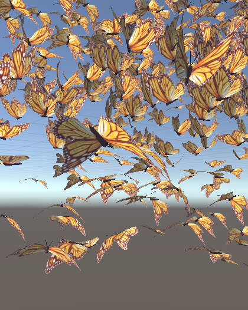
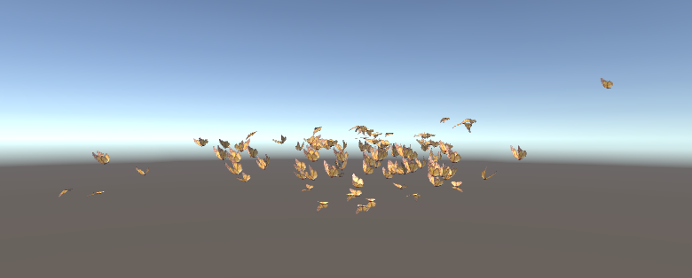

## Flocking and Predator Techniques in Video Games

"... and the thousands of fishes moved as a huge beast, piercing the water. They appeared united, inexorably bound to a common fate. How comes this unity?"
 --Anonymous, 17th century (from Shaw)

In my independent research, I have explored various artificial intelligence (AI) techniques and concepts. I will specifically be writing about what I have learned about flocking and predators in video games. As I have a mix of learning styles, I have applied what I have learned by building a test scene in unity to gain a practical understanding and retain what I have been researching. I will be discussing these concepts further in detail. Firstly, I would like to discuss a brief introduction to AI in video games

[live demo](https://vimeo.com/431711050)

##AI in video games

The increasing innovations and “advances in 3D visualization and physics-based simulation technology” make it possible for game developers to “create compelling, visually immersive gaming environments” that were only dreamed of years ago.
Games we play nowa days have grown in sophistication as has the players expectations of the degree of emersion they may experience while playing.  Therefore embracing ways to incorporate more cutting-edge AI advancements into games will enhance immersive player experience which is very beneficial.
AI is not just a field for those who have committed their careers to it but is fundamentally used by most game developers in one way or another.
“In the broadest sense, most games incorporate some form of artificial intelligence (AI). For instance, developers have used AI for years to give seemingly intelligent life to countless game characters, from the ghosts in the classic arcade game Pac Man to the bots in the first-person shooter Unreal, and many others in between. The huge variety of game genres and game characters necessitates a rather broad interpretation as to what is considered game AI. Indeed, this is true of AI in more traditional scientific applications as well.” Bough and Seemann ,D,G. AI for Game Developers © 2020 O'Reilly Media, Inc.

##Defining AI

This is a widely discussed topic that has varying opinions about the measuring up of artificial intelligence against human intelligence and all the facets that that would include. Any AI that may “measure up” to human intellect would be considered strong AI. This  type of AI would be non-deterministic and is rarely used in game design “because if you have a neural network continually adapting and learning new behaviours there would be a good chance that something unexpected could happen which could break the game.

Falling under the category of weak AI or deterministic behaviour, video games include a broader range of behaviours that give or mimic intelligence. For the most part, game AI gives the illusion of intelligence which makes the player experience immersive and most importantly, exciting. This type of AI is favoured by game designers as it still ensures predictability but with the illusion of uncertainty by some impressive programming techniques.  

###Deterministic Versus Nondeterministic AI

###Deterministic

“Deterministic behaviour or performance is specified and predictable. There’s no uncertainty. An example of deterministic behaviour is a simple chasing algorithm. You can explicitly code a nonplayer character to move toward some target point by advancing along the x and y coordinate axes until the character’s x and y coordinates coincide with the target location.”

###Nondeterministic

“Nondeterministic behaviour is the opposite of deterministic behaviour. Behaviour has a degree of uncertainty and is somewhat unpredictable (the degree of uncertainty depends on the AI method employed and how well that method is understood). An example of nondeterministic behaviour is a nonplayer character learning to adapt to the fighting tactics of a player. Such learning could use a neural network, a Bayesian technique, or a genetic algorithm.”
With understanding the difference between deterministic and nondeterministic AI, my flocking and predator behaviour that I have built-in unity falls under the deterministic AI. Based on a physical science concept often used in modelling motion, potential function based movements is a technique that handles chasing, evading swarming, and collision avoidance simultaneously
D. R. BRILLINGER, H. K. PREISLER, A. A. AGER, J. G. KIE

##Flocking

To portray realistic  behaviours in video games, “nonplayer characters must move in cohesive groups rather than independently.” Thus,  portraying the illusion that the nonplayer characters have a purpose. Properties in the flock such as collision, direction and force (speed) propagate from one member to the next member in the flock, giving it a unified behaviour. If we had to create every single member independently and then put them into a flock it would be extremely labour intensive. Fortunately, flocking algorithms such as the one presented by Craig Reynolds in his 1987 SIGGRAPH paper, “Flocks, Herds, and Schools: Gives us an amazing foundation for group behaviours. Furthermore, it demonstrates that it doesn’t take “ a huge leap of faith to see that you could apply such flocking behaviour” to a variety of creatures even that of human characters.

[Reynolds, Craig W. (1987). "Flocks, herds, and schools: A distributed behavioral model". Proceedings of the 14th Annual Conference on Computer Graphics and Interactive Techniques]

[Craig Reynolds – Original 1986 Boids simulation]()

Inspired by the monarch butterfly migration from Canada to Mexico I have used swarming butterflies in my unity game example.

[Monarch butterfly migration article](https://www.nationalgeographic.com/news/2017/10/monarch-butterfly-migration/)

[Monarch butterfly migration video](https://www.youtube.com/watch?v=lWOySU_hAz0)

