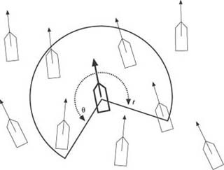
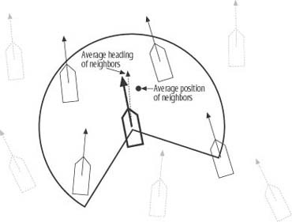
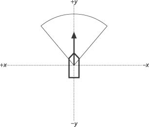
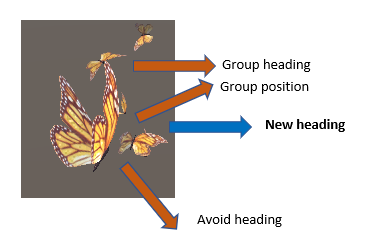
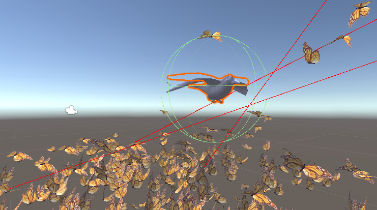

## Flocking and Predator Techniques in Video Games

"... and the thousands of fishes moved as a huge beast, piercing the water. They appeared united, inexorably bound to a common fate. How comes this unity?"
 --Anonymous, 17th century (from Shaw)

In my independent research, I have explored various artificial intelligence (AI) techniques and concepts. I will specifically be writing about what I have learned about flocking and predators in video games. As I have a mix of learning styles, I have applied what I have learned by building a test scene in unity to gain a practical understanding and retain what I have been researching. I will be discussing these concepts further in detail. Firstly, I would like to discuss a brief introduction to AI in video games

[live demo](https://vimeo.com/431711050)

## AI in video games

The increasing innovations and “advances in 3D visualization and physics-based simulation technology” make it possible for game developers to “create compelling, visually immersive gaming environments” that were only dreamed of years ago.
Games we play nowa days have grown in sophistication as has the players expectations of the degree of emersion they may experience while playing.  Therefore embracing ways to incorporate more cutting-edge AI advancements into games will enhance immersive player experience which is very beneficial.

AI is not just a field for those who have committed their careers to it but is fundamentally used by most game developers in one way or another.
“In the broadest sense, most games incorporate some form of artificial intelligence (AI). For instance, developers have used AI for years to give seemingly intelligent life to countless game characters, from the ghosts in the classic arcade game Pac Man to the bots in the first-person shooter Unreal, and many others in between. The huge variety of game genres and game characters necessitates a rather broad interpretation as to what is considered game AI. Indeed, this is true of AI in more traditional scientific applications as well.” [Bough and Seemann ,D,G. AI for Game Developers © 2020 O'Reilly Media, Inc.](https://www.oreilly.com/library/view/ai-for-game/0596005555/index.html)

## Defining AI

This is a widely discussed topic that has varying opinions about the measuring up of artificial intelligence against human intelligence and all the facets that that would include. Any AI that may “measure up” to human intellect would be considered strong AI. This  type of AI would be non-deterministic and is rarely used in game design “because if you have a neural network continually adapting and learning new behaviours there would be a good chance that something unexpected could happen which could break the game.

Falling under the category of weak AI or deterministic behaviour, video games include a broader range of behaviours that give or mimic intelligence. For the most part, game AI gives the illusion of intelligence which makes the player experience immersive and most importantly, exciting. This type of AI is favoured by game designers as it still ensures predictability but with the illusion of uncertainty by some impressive programming techniques.  

## Deterministic Versus Nondeterministic AI

### Deterministic

“Deterministic behaviour or performance is specified and predictable. There’s no uncertainty. An example of deterministic behaviour is a simple chasing algorithm. You can explicitly code a nonplayer character to move toward some target point by advancing along the x and y coordinate axes until the character’s x and y coordinates coincide with the target location.”
[Bough and Seemann ,D,G. AI for Game Developers © 2020 O'Reilly Media, Inc.](https://www.oreilly.com/library/view/ai-for-game/0596005555/index.html)

### Nondeterministic

“Nondeterministic behaviour is the opposite of deterministic behaviour. Behaviour has a degree of uncertainty and is somewhat unpredictable (the degree of uncertainty depends on the AI method employed and how well that method is understood). An example of nondeterministic behaviour is a nonplayer character learning to adapt to the fighting tactics of a player. Such learning could use a neural network, a Bayesian technique, or a genetic algorithm.”
[Bough and Seemann ,D,G. AI for Game Developers © 2020 O'Reilly Media, Inc.](https://www.oreilly.com/library/view/ai-for-game/0596005555/index.html)

With understanding the difference between deterministic and nondeterministic AI, my flocking and predator behaviour that I have built-in unity falls under the deterministic AI. Based on a physical science concept often used in modelling motion, potential function based movements is a technique that handles chasing, evading swarming, and collision avoidance simultaneously

[D. R. BRILLINGER, H. K. PREISLER, A. A. AGER, J. G. KIE](https://www.stat.berkeley.edu/~brill/Papers/fraser8.pdf)

## Flocking

To portray realistic  behaviours in video games, “nonplayer characters must move in cohesive groups rather than independently.” Thus,  portraying the illusion that the nonplayer characters have a purpose. Properties in the flock such as collision, direction and force (speed) propagate from one member to the next member in the flock, giving it a unified behaviour. If we had to create every single member independently and then put them into a flock it would be extremely labour intensive. Fortunately, flocking algorithms such as the one presented by Craig Reynolds in his 1987 SIGGRAPH paper, “Flocks, Herds, and Schools: Gives us an amazing foundation for group behaviours. Furthermore, it demonstrates that it doesn’t take “ a huge leap of faith to see that you could apply such flocking behaviour” to a variety of creatures even that of human characters.

[Reynolds, Craig W. (1987). "Flocks, herds, and schools: A distributed behavioral model". Proceedings of the 14th Annual Conference on Computer Graphics and Interactive Techniques](https://citeseerx.ist.psu.edu/viewdoc/summary?doi=10.1.1.1080.1217)

[Craig Reynolds – Original 1986 Boids simulation](https://www.youtube.com/watch?v=86iQiV3-3IA)

Inspired by the monarch butterfly migration from Canada to Mexico I have used swarming butterflies in my unity game example.

[Monarch butterfly migration article](https://www.nationalgeographic.com/news/2017/10/monarch-butterfly-migration/)

[Monarch butterfly migration video](https://www.youtube.com/watch?v=lWOySU_hAz0)

When discussing his simulated flocks Craig Reynolds coined the term boids.

“ All the boids can be moving in one direction at one moment, and then the next moment the tip of the flock formation can turn and the rest of the flock will follow as a wave of turning boids propagates through the flock. Reynolds’ implementation is leaderless in that no one boid actually leads the flock; in a sense they all sort of follow the group, which seems to have a mind of its own. The motion Reynolds’ flocking algorithm generated is quite impressive. Even more impressive is the fact that this behaviour is the result of three elegantly simple rules. These rules are summarized as follows:”
[Bough and Seemann ,D,G. AI for Game Developers © 2020 O'Reilly Media, Inc.](https://www.oreilly.com/library/view/ai-for-game/0596005555/index.html)

### Cohesion
“Have each member steer toward the average position of its neighbours.”
### Alignment
“Have each member align itself to the average heading of its neighbours.”
### Separation
“Have each member steer to avoid hitting its neighbours.”

These rules make it clear that the members of the flock need to be aware of each other and have the ability to direct their movement. Within each member’s immediate vicinity,  it knows the rough location, direction and separation from the other members in its territory.
You don’t have to worry about rotation when using particles which would make it easier to prototype however to build a more realistic version of what might be designed in a game,  I have used a butterfly prefab which allows me to take care of orientation. Including them rotating to face the direction they need to be going and turning away from obstacles that they need to be avoiding.

•	Turn to the average heading of the group
•	Turn to the average centre of the group
•	And avoid bumping into those around you

[Member visibility](https://www.oreilly.com/library/view/ai-for-game/0596005555/ch04.html)

The above diagram shows how a member of the flock should be concerned with what is happening in its immediate vicinity

## My Unity Flocking Example

The example I have made involves simulating several members of butterflies that can move around in flocks or one big flock, depending on the values you change in the inspector via the flock manager. Applying the [bounds method](https://docs.unity3d.com/2019.4/Documentation/ScriptReference/Bounds.Contains.html), the swarm is bound in a box. If they venture out of those borders, they are prompted to turn around being directed back to the center of the box, using a [slerp](https://docs.unity3d.com/2019.4/Documentation/ScriptReference/Quaternion.Slerp.html). They may also be directed to turn away from an obstacle or predator employing a [reflection vector](https://docs.unity3d.com/2019.4/Documentation/ScriptReference/Vector3.Reflect.html).If they are not prompted to turn they will apply the swarm rules which I will be discussing further in detail below.

### The FlockManager.cs  

Creates all the butterflies and informs them about the other butterflies in the swarm. To start, it simply creates an array of cubes (butterflies) and instantiates all the cube objects and puts them at a random position within the location of the flock managers fly limits using a neutral rotation.

For a cohesive swarm, it is better to use a large range as this will allow a member to see more of the group and direct themselves accordingly. Navigating around obstacles can also cause the swarm to break up. Thus, using a larger range will assist the members of the swarm re-grouping.

Some members may fragment if they lose sight of their neighbours as their neighbour could have been their link to the swarm. When they come within sight of a member again, they would re-join the swarm.

On the other hand, if you use a smaller range the swarm will start to fragment into smaller swarms as they lose sight and their link to the extended swarm.

**You can test this by changing the butterfly settings in the inspector via the flock manager**

### Flock.cs

Attached to the butterfly prefab and linked to the FlockManager.cs, the Flock.cs applies the rules.

## Cohesion

To unify the swarm each member needs to direct themselves to the average position of its neighbours.

**The sum of all positions divided the number in the group**
 

 [Average position and heading of neighbours](https://www.oreilly.com/library/view/ai-for-game/0596005555/index.html)

## Alignment

**Add all the headings of the individuals together and divide by the size of the group**

Alignment denotes that we want all the members in the swarm to generally head in the same direction. To satisfy this rule, I have the swarm following a goal that randomly updates it position within its bounds. There are also random speed ranges which adds to the illusion of natural behaviour for the swarm.

## Separation

If we reflect on the avoidance rule, we are trying to prevent the members from bumping into each other, “while at the same time enabling the members to get close to each other based on the alignment and cohesion rules” Therefore, we’ll enforce separation by requiring the members to direct themselves “away from any neighbour that is within view and within a prescribed minimum [separation distance”](https://www.oreilly.com/library/view/ai-for-game/0596005555/index.html)

[Neighbours and separation](https://www.oreilly.com/library/view/ai-for-game/0596005555/index.html)

### Neighbours

As discussed earlier, each member of the swarm needs to be aware of its neighbours. Because the arrangement of the members in the swarm will change constantly, each member must update its view of the world each time through a for-loop. This is done for each member of the swarm to obtain each member’s unique viewpoint

**Calculating a new heading**

**new heading = vectors for group heading + avoid heading + group position**

## Predator and Obstacle Avoidance

“The flocking rules we discussed so far yield impressive results. However, such flocking behaviour would be far more realistic and useful in games if the units also could avoid running into objects in the game world as they move around in a flock. As it turns out, adding such obstacle avoidance behaviour is a relatively simple matter. All we have to do is provide some mechanism for the units to see ahead of them and then apply appropriate steering forces to avoid obstacles in their [paths.”](https://www.oreilly.com/library/view/ai-for-game/0596005555/index.html)

**In the example I built in unity, I have used the above technique**

By creating a physics ray-cast on the butterflies we can test to detect a collision. Colliders would need to be attached to either an obstacle or a predator to detect it. Once detected the butterfly will turn away from it. As the bound method would have the butterflies redirecting to the center when turning it was best to look at directing them differently in this case. I have used the [reflection method.](https://docs.unity3d.com/2019.4/Documentation/ScriptReference/Vector3.Reflect.html)

The avoidance procedure does not guarantee zero collisions between members of the swarm and obstacles.

A given member of the swarm could receive conflicting direction information that may guide it straight into an obstacle or predator.
If a member “happens to get too close to a neighbour on one side while at the same time trying to avoid an obstacle on the other side. Depending on the relative distances from the neighbour and the obstacle, one steering force might dominate the other, causing a [collision.”](https://www.oreilly.com/library/view/ai-for-game/0596005555/index.html) To try and mitigate this from happening I have worked on a collision detection with a response of turning away from the obstacle or predator.

There is an interesting study where a video game has been used to help researchers “learn more about how tiny European starlings keep predators at bay.” Using players to “target” virtual birds in a **murmuration pattern** researches have been able to reiterate the confusion such behaviour causes.

[Example of murmuration pattern](https://www.youtube.com/watch?v=Qgz0xQRlOCk)

**You can see a similar result in the pattern the swarm develop in the unity flocking example if you increase the maximum speed and rotation speed in the butterfly settings via the flock manager.**

[Live Demo:](https://vimeo.com/432018256)

In conclusion,

I have often been mesmerised observing flocking behaviours in nature. This naturally has led to my fascination observing similar behaviours simulated in video games. One instance that demonstrated a unique player experience was the example of gameplay in Red Dead Redemption where a bird was shot out of the sky completely by chance. This was the result of embracing AI techniques in game design where a flocking algorithm and player behaviour crossed paths and created a unique outcome.
Flocking is just a facet of AI techniques commonly used today. AI is an evolving field and no doubt we will be seeing even more elaborate techniques used in video games in the not too distant future . I have found researching AI in video games a fascinating study, one of which I believe I will continue to research for years to come.   

**References:**

[Reynolds, Craig W. (1987). "Flocks, herds, and schools: A distributed behavioral model". Proceedings of the 14th Annual Conference on Computer Graphics and Interactive Techniques](https://citeseerx.ist.psu.edu/viewdoc/summary?doi=10.1.1.1080.1217)

[D. R. BRILLINGER, H. K. PREISLER, A. A. AGER, J. G. KIE, THE USE OF POTENTIAL FUNCTIONS IN MODELLING ANIMAL MOVEMENT](https://www.stat.berkeley.edu/~brill/Papers/fraser8.pdf)

[Bough and Seemann ,D,G. AI for Game Developers © 2020 O'Reilly Media, Inc.](https://www.oreilly.com/library/view/ai-for-game/0596005555/index.html)

**Sources:**

https://docs.unity3d.com/2019.4/Documentation/ScriptReference/UnityEngine.AIModule.html
https://learn.unity.com/course/ml-agents-hummingbirds
https://learn.unity.com/course/artificial-intelligence-for-beginners
https://docs.unity3d.com/2019.4/Documentation/ScriptReference/Bounds.Contains.html
https://docs.unity3d.com/2019.4/Documentation/ScriptReference/Quaternion.Slerp.html
https://docs.unity3d.com/2019.4/Documentation/ScriptReference/Vector3.Reflect.html
https://www.physicsclassroom.com/class/refln/Lesson-1/The-Law-of-Reflection
https://www.youtube.com/watch?v=NPuYtHZud0o

[Craig Reynolds – Original 1986 Boids simulation](https://www.youtube.com/watch?v=86iQiV3-3IA)
https://www.youtube.com/watch?v=Qgz0xQRlOCk

**Monarch Butterfly migration:**

https://www.nationalgeographic.com/news/2017/10/monarch-butterfly-migration/
https://www.youtube.com/watch?v=lWOySU_hAz0
